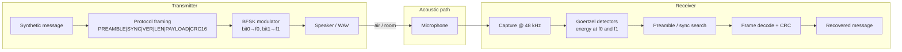
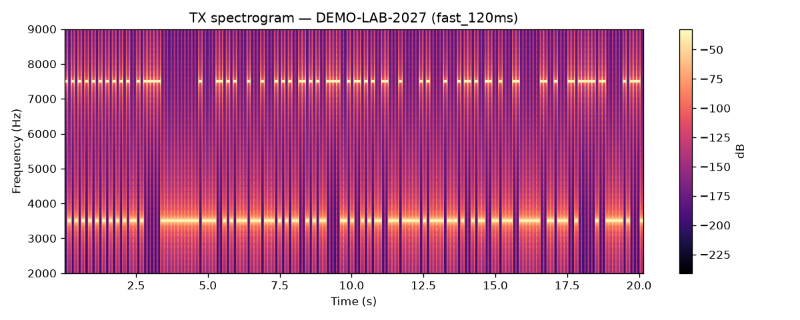
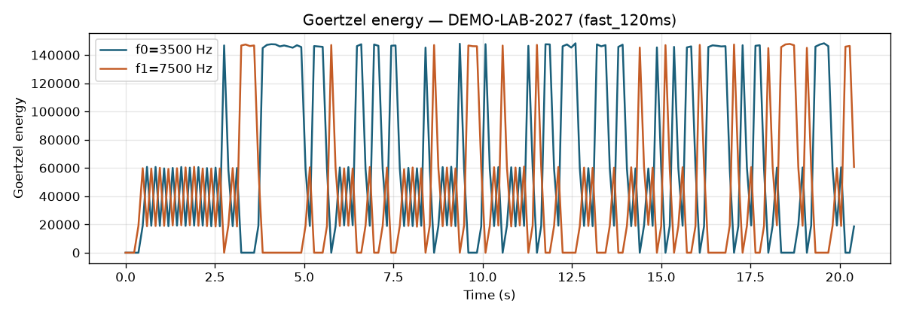
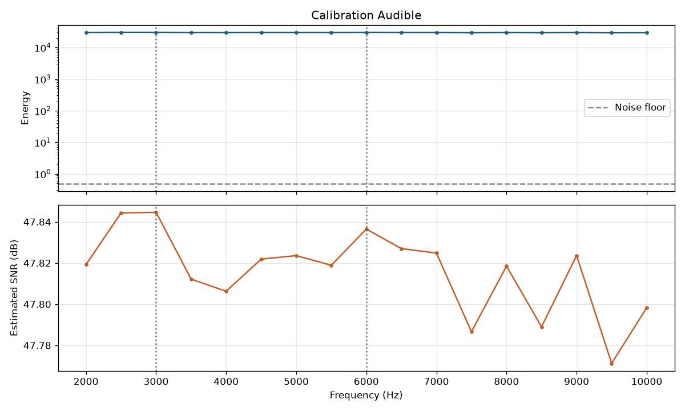

# Acoustic Channel PoC (BFSK)

Educational, **local** proof of concept that transmits a short **synthetic** text message through a computer speaker and recovers it with an external microphone on the same PC.

Built for an **authorized cybersecurity conference demo** to illustrate that an acoustic path can carry framed digital data — not for covert use, malware, or collecting real user information.

## Upgrade features (conference-ready)

* CPFSK continuous-phase modulation (`--modulation cpfsk`) alongside legacy BFSK
* Optional Hamming(7,4) FEC (`--fec hamming74`) with CRC after FEC
* Correlation sync (`--sync-mode correlation`) and carrier neighbourhood search
* Hardware profile, physical calibration package, carrier recommendations
* Experiment runner: `python -m src.experiment`
* Stage demo / replay: `python -m src.stage_demo`
* **Live terminal monitor:** `python -m src.live_monitor` (waveform, tone bars, bits → message)
* Demo-day configs: `docs/demo-day-configs.md`
* Docs: `docs/conference-runbook.md`, `docs/results-summary.md`

Physical results are labelled **PHYSICAL_RX** and curated under `output/samples/` (full dumps may live locally in `experiments/`). Simulation artefacts are labelled **SIMULATED_RX**.

### Quick demo (audible, remote TX)

```bash
python -m src.live_monitor --remote-tx nkn@192.168.68.109 \
  --remote-output-device 1 --message DEMO-LAB-2027 --modulation cpfsk
```

### Physical calibration

```bash
python scripts/physical_calibration_remote.py --band both
# → output/calibration-audible-physical
# → output/calibration-near-us-physical
```

## Ethical and authorized-use statement


* Use only in a controlled lab or conference demo with explicit authorization.
* Transmit **only** manually supplied synthetic payloads (for example `DEMO-LAB-2027`).
* Do **not** use this software to access passwords, browser data, files, environment variables, credentials, clipboard contents, or any real user information.
* This repository does **not** implement malware, persistence, privilege escalation, evasion, exploitation, remote control, or automatic data collection.
* There is **no network** component. All I/O is local speaker / microphone / files you explicitly request.
* Audible mode is the **default**. Near-ultrasonic mode requires `--near-ultrasonic` and prints a high-frequency warning.
* Keep speaker volume low. Default amplitude is deliberately limited (`0.15`).

## Architecture



| Layer | Module | Role |
| --- | --- | --- |
| Protocol | `src/protocol.py` | Framing, CRC-16-CCITT, bit packing |
| DSP | `src/modulation.py` | BFSK tones, Goertzel, channel impairments |
| TX CLI | `src/transmitter.py` | Encode, play / dry-run, save WAV/PNG |
| RX CLI | `src/receiver.py` | Record / simulate, demodulate, live UI |
| Devices | `src/audio_devices.py` | List / validate PortAudio devices |
| Calibration | `src/calibration.py` | Frequency sweep + SNR recommendations |
| Plots | `src/visualizer.py` | Waveform, spectrogram, energy, timeline |

## BFSK (Binary Frequency Shift Keying)

Each bit is a short sine tone:

* Bit `0` → `frequency_zero` (default **3500 Hz**)
* Bit `1` → `frequency_one` (default **7500 Hz**)

Default symbol duration is **120 ms** (~8.3 bit/s raw) via the `fast` profile.
Use `--profile reliable` for 200 ms / 4–6 kHz when the room is noisy.

## Goertzel algorithm

The receiver measures energy at **exactly two** frequencies per symbol window using Goertzel (a single-bin DFT). A full FFT is optional for spectrograms; bit decisions use Goertzel because only `f0` and `f1` matter.

For each symbol the receiver reports `energy_zero`, `energy_one`, `energy_ratio`, and `confidence`. If energies are too similar, the symbol is marked **uncertain** and is not treated as a reliable bit.

## Nyquist frequency

With `sample_rate = 48000`, the theoretical Nyquist frequency is **24 kHz**. Real speakers, microphones, codecs, drivers, and analogue filters often roll off **well before** that limit. Near-ultrasonic tones (18.5 / 19.5 kHz) are therefore experimental and hardware-dependent.

## Installation

### Linux audio dependencies

Debian / Ubuntu (PipeWire or PulseAudio stacks):

```bash
sudo apt update
sudo apt install -y python3-venv python3-pip portaudio19-dev libsndfile1 \
  pipewire-audio pulseaudio-utils alsa-utils
```

Fedora:

```bash
sudo dnf install python3-virtualenv portaudio-devel libsndfile pipewire-utils alsa-utils
```

Prefer **wired** speakers and microphones for the first tests. Bluetooth codecs and sample-rate conversion frequently damage high-frequency content.

### Virtual environment

```bash
cd acoustic-channel-poc
python3 -m venv .venv
source .venv/bin/activate
pip install --upgrade pip
pip install -r requirements.txt
```

## Same-PC testing workflow

1. Connect an external microphone (USB or jack).
2. List devices: `python -m src.audio_devices`
3. Start the **receiver** in one terminal.
4. Start the **transmitter** (audible mode) in a second terminal.
5. Confirm the recovered message and CRC status.
6. Inspect the spectrogram PNG if generated.
7. Run calibration to pick strong frequencies.
8. Only after audible success, try `--near-ultrasonic`.
9. Keep the microphone about **20–50 cm** from the speaker.
10. Reduce speaker volume before near-ultrasonic tests.

**Avoid acoustic feedback:** do not route the live microphone input back to the speakers (disable loopback / monitoring).

## Command reference

### List audio devices

```bash
python -m src.audio_devices
```

### Transmit (audible default)

```bash
python -m src.transmitter \
  --message "DEMO-LAB-2027" \
  --output-device 2
```

### Dry-run (no playback)

```bash
python -m src.transmitter \
  --message "DEMO-LAB-2027" \
  --dry-run \
  --save-wav output/demo.wav \
  --spectrogram output/demo.png \
  --waveform-plot output/demo_wave.png
```

### Receive

```bash
python -m src.receiver \
  --input-device 4 \
  --duration 30
```

### Simulate (no hardware)

```bash
python -m src.receiver \
  --simulate \
  --message "DEMO-LAB-2027" \
  --noise-level 0.02
```

### Near-ultrasonic (explicit flag required)

```bash
python -m src.transmitter \
  --message "DEMO-LAB-2027" \
  --frequency-zero 18500 \
  --frequency-one 19500 \
  --near-ultrasonic \
  --amplitude 0.08

python -m src.receiver \
  --input-device 4 \
  --frequency-zero 18500 \
  --frequency-one 19500 \
  --near-ultrasonic \
  --duration 30
```

### Calibration

```bash
python -m src.calibration --input-device 4 --output-device 2
python -m src.calibration --input-device 4 --output-device 2 --near-ultrasonic
python -m src.calibration --dry-run --plot output/calibration_response.png
```

## Protocol

```text
PREAMBLE (16) | SYNC (16) | VERSION (8) | LENGTH (8) | PAYLOAD (≤32 bytes) | CRC16 (16)
```

* Preamble: `1010101010101010`
* Sync: `1010010111110000` (0xA5F0)
* Version: `0x01`
* CRC: CRC-16-CCITT over `VERSION | LENGTH | PAYLOAD`
* Maximum payload: **32 bytes**; empty payloads are rejected

The receiver **searches** for preamble + sync; recording does not need to start exactly at the first bit.

## Default DSP parameters

| Parameter | Default (`fast`) | `reliable` | `turbo` (experimental) |
| --- | --- | --- | --- |
| Symbol duration | **0.12 s** | 0.20 s | 0.08 s |
| Raw bit rate | **~8.3 bit/s** | 5 bit/s | 12.5 bit/s |
| f0 / f1 | **3500 / 7500 Hz** | 4000 / 6000 Hz | 3000 / 8000 Hz |
| Amplitude | 0.20 | 0.20 | 0.22 |
| `DEMO-LAB-2027` (1×) | **~20 s** | ~34 s | ~13 s |

Use profiles:

```bash
# Default / recommended for demos
python -m src.transmitter --message DEMO-LAB-2027 --output-device 0
python -m src.receiver --input-device 0 --duration 45

# Maximum reliability (slower)
python -m src.transmitter --profile reliable --message DEMO-LAB-2027 --output-device 0
python -m src.receiver --profile reliable --input-device 0 --duration 60

# Experimental faster mode
python -m src.transmitter --profile turbo --message HELLO --output-device 0
```

On this lab PC, live tests reached **100% frame success at 120 ms + 3.5/7.5 kHz**.
At 100 ms success dropped to 0% — so `fast` is the practical ceiling without FEC.

## Visualizations

Optional CLI outputs (not required for basic operation):

1. Waveform plot (`--waveform-plot`)
2. Spectrogram (`--spectrogram`)
3. Energy-over-time for both tones (`--energy-plot` on receiver)
4. Calibration frequency-response (`calibration --plot`)
5. Decoded bit timeline (`--bit-timeline`)

### Screenshots and sample media

Curated artefacts (payload `DEMO-LAB-2027`, no `POL` strings):

| Preview | Path |
| --- | --- |
| Fast TX spectrogram | [`output/screenshots/spectrogram.png`](output/screenshots/spectrogram.png) |
| Reliable TX spectrogram | [`output/screenshots/spectrogram_reliable.png`](output/screenshots/spectrogram_reliable.png) |
| Waveform | [`output/screenshots/waveform.png`](output/screenshots/waveform.png) |
| Goertzel energy | [`output/screenshots/energy_over_time.png`](output/screenshots/energy_over_time.png) |
| Bit timeline | [`output/screenshots/bit_timeline.png`](output/screenshots/bit_timeline.png) |
| Calibration (audible) | [`output/screenshots/calibration.png`](output/screenshots/calibration.png) |
| Calibration (near-US) | [`output/screenshots/calibration_near_us.png`](output/screenshots/calibration_near_us.png) |
| Near-ultrasonic spectrogram | [`output/screenshots/near_ultrasonic_spectrogram.png`](output/screenshots/near_ultrasonic_spectrogram.png) |

Additional WAV/PNG pairs for blog write-ups live under [`output/samples/`](output/samples/).







## Expected demo output

**Transmitter (dry-run):**

```text
Active transmitter configuration
  message          = 'DEMO-LAB-2027'
  sample_rate      = 48000
  symbol_duration  = 0.2
  frequency_zero   = 4000.0
  frequency_one    = 6000.0
  amplitude        = 0.15
Expected transmission duration: ~30+ s (depends on frame size)
Dry-run complete — no audio played.
```

**Receiver (simulate):**

```text
frame success    = True
Recovered message: 'DEMO-LAB-2027'
bit error rate   = 0.0000
```

## Reliability benchmark

Measure frame-success rate and BER across several synthetic messages:

```bash
# In-memory channel (no hardware)
python -m src.benchmark --simulate --noise-level 0.03

# Live speaker → microphone (uses duplex capture; for best results on Linux
# prefer the two-process helper which mirrors the working demo path)
PYTHONPATH=. python scripts/live_benchmark.py
```

The benchmark prints a per-message table and a summary:

```text
frames OK: 4/6 (66.7%)
mean BER: 0.0221
payload delivery: 66.7%
```

Tips for higher live success rate:

* Keep the mic about 20–50 cm from the speaker
* Avoid clipping (lower Capture gain / `--amplitude` if peak hits 1.0)
* Use `--repeats 2` (or 3) so the decoder can majority-vote copies
* Prefer wired devices; start the receiver a couple of seconds before TX

Coverage includes text↔bits, framing, CRC, preamble detection, clean/noisy decode, invalid CRC, empty and oversized payload rejection.

## Troubleshooting

### `PortAudioError`

* Install `portaudio19-dev` (or distro equivalent) and reinstall `sounddevice`.
* Confirm devices with `python -m src.audio_devices`.
* Try explicit `--input-device` / `--output-device` indices.

### Wrong input / output device

* Indexes change when USB devices are plugged in — re-list devices.
* Ensure the chosen input has `In > 0` and output has `Out > 0`.

### Microphone permission problems

* On some desktops, grant microphone access to the terminal / Python.
* Check that the mic is not exclusively locked by another app.

### PipeWire / PulseAudio / ALSA

* PipeWire: `wpctl status`, `pw-cli ls Node`
* PulseAudio: `pactl list short sources`, `pactl list short sinks`
* ALSA: `arecord -l`, `aplay -l`
* Prefer the PipeWire/Pulse “monitor” carefully — monitoring can create loops. Use a real capture source.

### Microphone recording silence

* Unmute capture in `pavucontrol` / `alsamixer`.
* Verify with `arecord -d 3 -f S16_LE -r 48000 /tmp/test.wav` and play it back.
* Use `--save-raw-wav output/raw.wav` on the receiver before assuming DSP failure.

### Audio clipping

* Lower `--amplitude` and OS speaker volume.
* The receiver warns when samples approach full scale.

### No detectable signal above 18 kHz

* Many laptop speakers and mics roll off early.
* Run `python -m src.calibration --near-ultrasonic`.
* Stay in audible mode for the conference demo if hardware fails.

### Laptop speakers filtering high frequencies

* Use an external USB DAC / speaker if available.
* Calibration will show a collapsing SNR at high frequencies.

### AGC / noise suppression / echo cancellation

* Disable microphone enhancements in the OS sound settings when possible.
* AGC can distort tone amplitudes; echo cancellation can notch tones that look like feedback.

### Bluetooth audio codecs

* SBC/AAC often low-pass aggressively. Use wired devices for tests.

### Sample-rate conversion

* Request 48 kHz end-to-end. Hidden resampling can shift effective tone frequencies.
* Check device default rates in `python -m src.audio_devices`.

## Safety notes

* Default volume is low; do not raise OS volume to maximum.
* Frequencies above **17 kHz** require `--near-ultrasonic` and display a warning.
* Payload size and transmission duration are limited by design.
* `--dry-run` generates artefacts without playing sound.
* This is a laboratory PoC for authorized demonstration only.

## Known hardware limitations

* Built-in laptop speakers often cannot reproduce >15–18 kHz cleanly.
* Consumer MEMS microphones vary widely above 16 kHz.
* Room noise, fans, voices, and mains hum reduce SNR.
* Start at 20–50 cm; do not expect long-range links with this PoC.

## Project layout

```text
acoustic-channel-poc/
├── README.md
├── requirements.txt
├── pytest.ini
├── src/
│   ├── __init__.py
│   ├── protocol.py
│   ├── modulation.py
│   ├── transmitter.py
│   ├── receiver.py
│   ├── calibration.py
│   ├── audio_devices.py
│   └── visualizer.py
├── tests/
│   ├── test_protocol.py
│   ├── test_modulation.py
│   └── test_decoder.py
└── output/
```

## License / intent

Educational cybersecurity demonstration material. No warranty. Use only with authorization and synthetic payloads.
